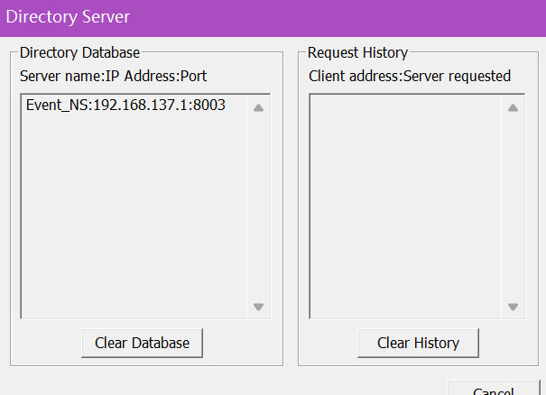

# Event Notification Service
## Prerequisite
- Platform: Windows
- Go Version: 1.20

## How to Run
1. Run DistributedSystemsWorkbench.exe and start Directory Service. You may find the program so strange that
it just only has a header. But try to click the white line to activate the menu.

And we've got:

2. Run CaseStudy_NotificationService_Server_CPP.exe

`192.168.137.1` is local address on my machine. Yours may be different. It may **take a while** to register the 
ENS to directory service.

3. Run Client Publisher. If you failed, try to add the flag `--lip <your local address>` 
```cgo
cd clientconsumer
go build
./clientconsumer.exe
```

4. Run Client Consumer. We can run several instances. If you failed, try to add the flag `--lip <your local address>`
```cgo
cd clientpublisher
go build
./clientpublisher
```
The Result is like this:
